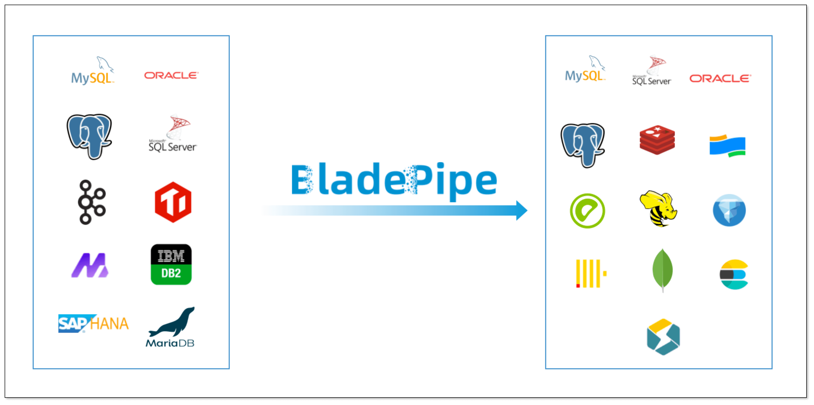
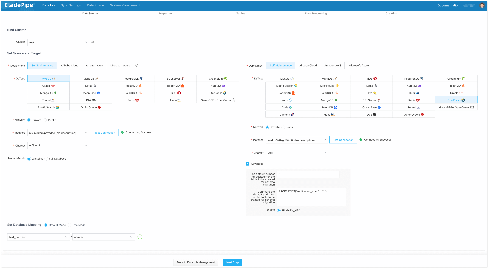

# BladePipe

## Introduction

BladePipe is a **real-time end-to-end data replication tool**, moving data between **30+** databases, message queues, search engines, caching, real-time data warehouses, data lakes and more, with **ultra-low latency** less than 3 seconds. It features efficiency, stability and scalability, compatibility with diverse database engines, one-stop management, enhanced security, and complex data transformation. BladePipe helps to break down data silos, increasing the value of data.

## Functions

BladePipe presents a visual management interface, allowing you to easily create DataJobs to realize **schema migration, data migration, synchronization, verification and correction**, etc. In addition, more refined and customized configurations are supported by setting parameters. Now BladePipe supports data movement from the following source DataSources to StarRocks:

  | Source DataSource | Schema Migration | Data Migration | Data Sync | Verification & Correction |
  | --- | --- | --- | --- | --- |
  | MySQL/MariaDB/AuroraMySQL | Yes | Yes | Yes | Yes |
  | Oracle            | Yes | Yes | Yes | Yes |
  | PostgreSQL/AuroraPostgreSQL | Yes | Yes | Yes | Yes |
  | SQL Server        | Yes | Yes | Yes | Yes |
  | Kafka             | No | No | Yes | No |
  | AutoMQ            | No | No | Yes | No |
  | TiDB              | Yes | Yes | Yes | Yes |
  | Hana              | Yes | Yes | Yes | Yes |
  | PolarDB for MySQL | Yes | Yes | Yes | Yes |
  | Db2               | Yes | Yes | Yes | Yes |
:::info
For more functions and parameter settings, please refer to [BladePipe Connections](https://doc.bladepipe.com/dataMigrationAndSync/connection/mysql2?target=StarRocks).
:::

## Installation

Follow the instructions in [Install Worker (Docker)](https://doc.bladepipe.com/productOP/docker/install_worker_docker) or [Install Worker (Binary)](https://doc.bladepipe.com/productOP/binary/install_worker_binary) to download and install a BladePipe Worker.

## Example
Taking a MySQL instance as an example, the following part describes how to move data from MySQL to StarRocks.

### Add DataSources

1. Log in to the [BladePipe Cloud](https://cloud.bladepipe.com/). Click **DataSource** > **Add DataSource**.
2. Select StarRocks as the Type, and fill in the setup form.
   - **Client Address**：The port StarRocks provided to MySQL Client. BladePipe queries the metadata in databases via it. 
   - **Account**: The user name of the StarRocks database. The INSERT permission is required to write data to StarRocks. If the user doesn't have the INSERT permission, please grant the permission with [GRANT](../../sql-reference/sql-statements/account-management/GRANT.md) as a reference.
   - **Http Address**：It is used to receive the request from BladePipe to write data to StarRocks.

1. Click **Test Connection**. After successful connection, click **Add DataSource** to add the DataSource.
2. Add a MySQL DataSource following the above steps.

### Create DataJob

1. Click **DataJob** > [**Create DataJob**](https://doc.bladepipe.com/operation/job_manage/create_job/create_full_incre_task).

2. Select the source and target DataSources, and click **Test Connection** to ensure the connection to the source and target DataSources are both successful.

3. Select **Incremental** for DataJob Type, together with the **Full Data** option.

4. Select the tables to be replicated. **Note that the target StarRocks tables automatically created after Schema Migration have primary keys, so source tables without primary keys are not supported currently**.

5. Select the columns to be replicated.

6. Confirm the DataJob creation.

7. The DataJob runs automatically. BladePipe will automatically run the following DataTasks:
   - **Schema Migration**: The schemas of the source tables will be migrated to the target instance.
   - **Full Data**: All existing data of the source tables will be fully migrated to the target instance.
   - **Incremental**: Ongoing data changes will be continuously synchronized to the target instance.

